# Hey, I'm Breno 

**Product · Technology · AI**

Data Science & AI student from Rio de Janeiro, building products, automations and AI-powered solutions.

---

## 🛠️ Toolkit

---

## ♟ I like chess. Never said I was good at it.

---

## ♞ My Contributions, But Make It Chess

<picture>
  <source media="(prefers-color-scheme: dark)" srcset="assets/knight-contributions.svg">
  <source media="(prefers-color-scheme: light)" srcset="assets/knight-contributions-light.svg">
  
</picture>

A chess knight hops across my real contribution graph. Regenerated daily by a GitHub Action.

---

## 🤝 Let's connect

---

> *Curious about how products work, why people use them, and how technology can make both better.*

